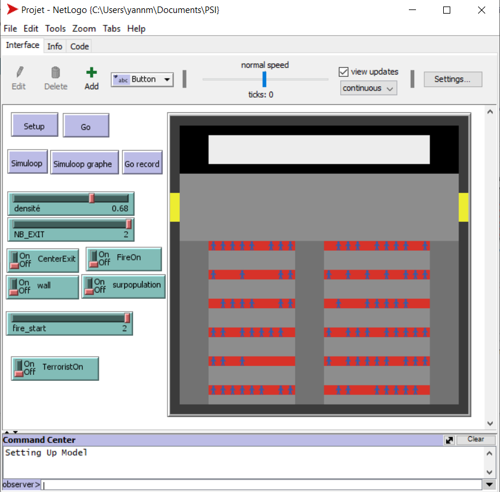
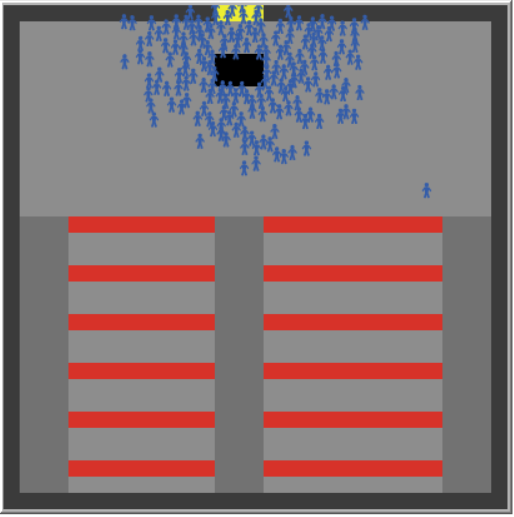
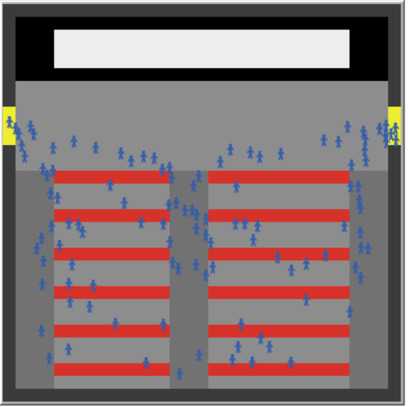
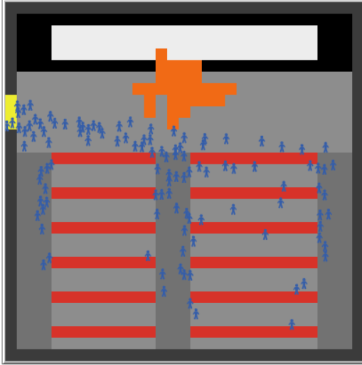

# PSI-L2 Fire simulation
## Context
This project was done in [Netlogo](https://fr.wikipedia.org/wiki/NetLogo). It consisted in creating a simulation of a fire in a cinema.

## Documents

The **project report** ([latex](./Rapport/Rapport.tex) / [pdf](./Rapport/Rapport.pdf)) made in [Latex](https://fr.wikipedia.org/wiki/LaTeX).   
My [**personal report**](journal_perso_Martin-dEscrienne.pdf) in the project.  
**Intermediate presentation slides** ([latex](./Presentation1/Presentation.tex) / [pdf](./Presentation1/Presentation.pdf))  
**Final Presentation slide** ([latex](./Presentation2/Presentation_finale.tex) / [pdf](./Presentation2/Presentation_finale.pdf)).  

Video of simulation are available in **Presentation 2** folder.

[csv folder](/csv) contain the project's **.csv** results files. (created automatically by the project's).

## How to run the project

[Download NetLogo](https://ccl.northwestern.edu/netlogo/download.shtml) and run [Projet.nlogo](Projet.nlogo)

## How simulation works 

_You can slow down the simulation at any time using the speed control bar at the top of netlogo._ 

* **Setup** allows you to set up the scene (do not press setup during a simulation).  

* **Go** starts the simulation step by step (press go record for continuous simulation).  

* **Simuloop , Simuloop graph and Go record** are used for .csv files.  

* **Density** increases or decreases the number of people in the cinema.  

* **NB_EXIT** corresponds to the number of cinema exits.  

* **CenterExit** places a single exit in the middle of the cinema and **wall** places a wall in front or not.  

* **Fire on** may or may not place a fire in the cinema . 

* **fire_start** places the fire in a certain place according to its value (0 starts anywhere in the room, 1 only at the bottom of the room, 2 only in the benches of the room).  

* **Overpopulation** adds even more people to the simulation (useful for the effects of a single entrance in the center).  

* **TerrosistOn** A bonus (not present in the presentation and report) that turns a character into a terrorist (pink) who stands in the center and explodes, causing a fire. 

## Screenshots

